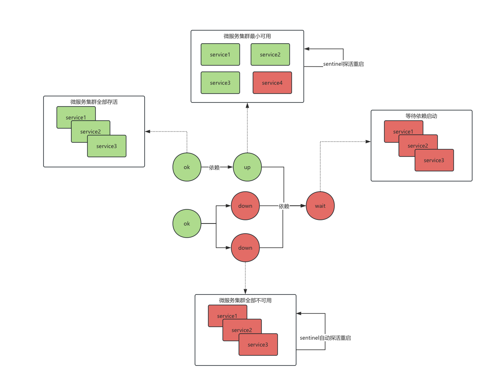

# sentinel
一款用来监控分布式服务是否存活的系统，当服务器重启时，可以根据依赖关系自动拉起对应的服务

## 设计理念
1. 针对小型项目的分布式服务监控，大型项目可以考虑使用k3s,k8s管理
2. 解决服务器重启时，存在依赖关系的分布式服务自动重启的场景
3. 通过配置的方式，将所有的项目的依赖关系组合成一个有向无环图，每个节点就是一个服务，支持多个服务组成一个服务组（微服务架构）
4. 每个节点通过心跳的方式，监控对应服务的健康状态，如果服务挂了，触发重启逻辑 
   1. 为了满足此功能，要求本服务是一直存活的状态，所以本服务应该具备自启动功能,且需要的依赖尽量少，最好是单体服务。
5. 因为项目的第一次启动和重启有时候是两个概念，所有本哨兵目前仅专注于服务的重启，不涉及服务的初始化创建

设计示意图如下：
