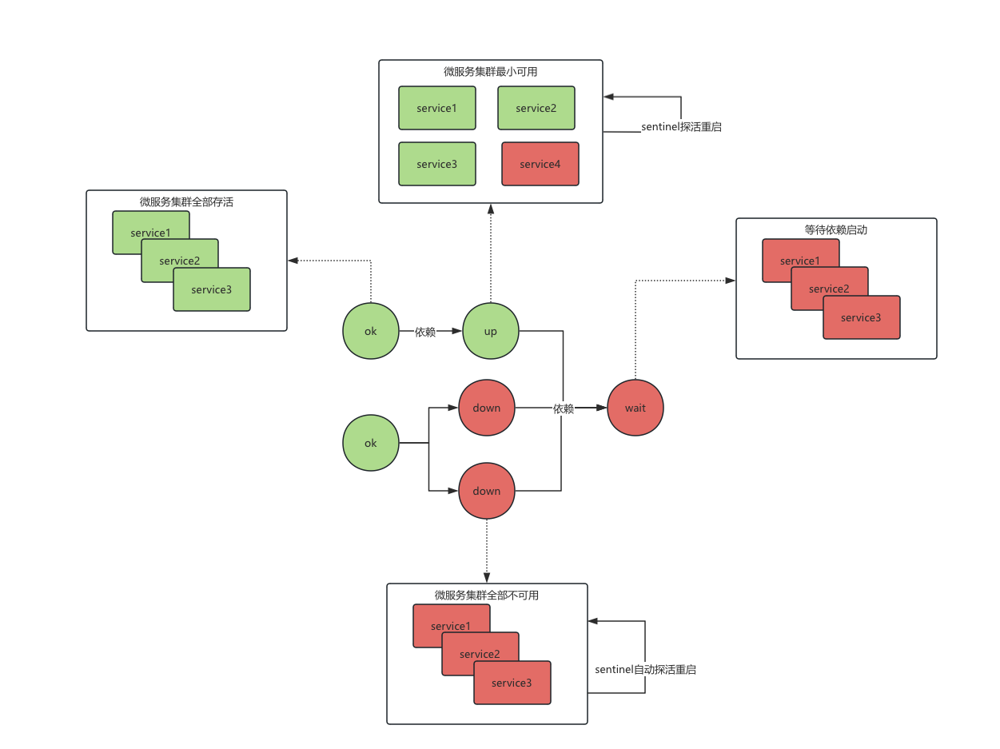

# Sentinel 哨兵监控

一款轻量级的分布式服务健康检查与自动故障恢复平台。当服务器重启时，能够根据集群间的依赖关系，按正确顺序自动拉起所有服务。

当前版本 **v1.0.0** 已完成核心功能，欢迎使用。

*[English Documentation](README_EN.md)*

---

## 核心功能

### 集群与节点管理
- **服务集群** — 将多个服务节点组成一个集群（微服务组），设置最小存活节点数，支持配置上游依赖集群
- **服务节点** — 为每个服务配置独立的探活方法和重启方法，支持 Shell 命令和 Docker 远程操作两种方式
- **Web 管理端** — Bootstrap 5.3 + Thymeleaf 构建，支持分页列表、弹窗表单、手动触发检查/重启、Toast 消息反馈

### 健康检查
| 检查方式 | 说明 |
|---------|------|
| **BASH** | 在 Sentinel 所在服务器上执行 Shell 命令，根据退出码判断健康状态 |
| **DOCKER_CHECKER** | 通过 Docker TLS 远程连接，拉取容器列表（`docker ps -a`），匹配目标容器并检查其 running 状态 |

### 自动重启
| 重启方式 | 说明 |
|---------|------|
| **BASH** | 执行自定义 Shell 命令完成服务重启 |
| **DOCKER_CLIENT** | 通过 Docker Remote API 执行 `docker start` 重新启动容器 |

### DAG 依赖图
- 所有集群按上游依赖关系自动构建**有向无环图（DAG）**
- 前端使用 AntV G6 渲染可视化依赖图，节点颜色按状态（ok/up/down/wait）区分
- 新增集群时自动校验循环依赖
- 删除集群时检查是否存在下游依赖

### 定时扫描与级联恢复
- **核心心跳任务**：每 60 秒从 DAG 起点开始 BFS 遍历所有集群，对每个节点执行健康检查，更新集群状态
- **故障恢复任务**：检测到 `down` 状态的集群后，找到最前置的下线集群优先恢复，成功后再级联通知下游 `wait` 状态集群
- **Docker 连接回收**：每 10 分钟清理空闲 Docker 客户端连接，避免资源泄露

### Docker TLS 集成
- 支持**全局默认证书**和**按主机独立证书**两种配置
- 自动证书路径解析（相对路径→绝对路径）
- 连接缓存与健康检查，失败自动驱逐
- 连接超时 10s，响应超时可配（默认 30s）

---

设计示意图：



---

## 技术栈

| 分层 | 技术 |
|------|------|
| 框架 | Spring Boot 3.4.6 |
| Java | 21 |
| 数据库 | SQLite（文件持久化，零依赖） |
| ORM | MyBatis-Flex 1.10.9 |
| 前端模板 | Thymeleaf |
| UI 框架 | Bootstrap 5.3 + Font Awesome 6 |
| 依赖图 | AntV G6 |
| 命令行执行 | Apache Commons Exec 1.5.0 |
| Docker SDK | docker-java 3.7.1 + Apache HttpClient 5 |
| 构建 | Maven |

---

## 快速开始

### 环境要求
- JDK 21+
- Maven 3.6+

### 运行

```bash
git clone https://github.com/hancher/sentinel.git
cd sentinel

# 直接运行
./mvnw spring-boot:run

# 或打包运行
./mvnw package -DskipTests
java -jar target/sentinel-1.0.0-SNAPSHOT.jar
```

浏览器访问：**http://localhost:6060**

---

## 配置说明

`src/main/resources/application.properties`：

```properties
# 服务端口
server.port=6060

# SQLite 数据库（首次启动自动创建 db.sqlite）
spring.datasource.url=jdbc:sqlite:db.sqlite

# Sentinel 版本
sentinel.version=1.0.0

# Docker TLS 全局证书路径
sentinel.processor.docker.cert_path=/path/to/certs

# Docker 连接空闲回收间隔（分钟），-1 表示不回收
sentinel.processor.docker.max_idle_minutes=30

# 按主机配置独立证书路径（可选）
# sentinel.processor.docker.host-certs[tcp://192.168.1.1:2376]=/path/to/certs-a
```

### Docker TLS 证书要求

证书目录需包含以下文件：
```
certs/
├── ca.pem           # CA 证书
├── cert.pem         # 客户端证书
├── key.pem          # 客户端密钥
```

目标服务器 Docker Daemon 需启用 TCP + TLS：
```json
{
  "hosts": ["unix:///var/run/docker.sock", "tcp://0.0.0.0:2376"],
  "tls": true,
  "tlsverify": true,
  "tlscacert": "/etc/docker/certs/ca.pem",
  "tlscert": "/etc/docker/certs/server-cert.pem",
  "tlskey": "/etc/docker/certs/server-key.pem"
}
```

---

## 核心概念

### 集群（Cluster）与节点（Node）

```
┌────────── Cluster A ──────────┐
│  ├ Node a-1 (BASH ping)       │
│  ├ Node a-2 (BASH ping)       │    依赖
│  └ Node a-3 (BASH ping)       │──────────▶ Cluster B
└───────────────────────────────┘            ├ Node b-1
                                             └ Node b-2
```

- **集群** 是服务的抽象分组，多个节点组成一个集群，集群可设置 `minAliveNum`
- **节点** 是具体的服务实例，每个节点有独立的探活方法和重启方法
- **依赖关系** 以集群为粒度，配置在集群的 `dependClusters` 字段中

### 集群状态

| 状态 | 含义 |
|------|------|
| `ok` | 全部节点健康 |
| `up` | 部分节点健康，达到 `minAliveNum` |
| `down` | 低于最小存活数 |
| `wait` | 等待上游依赖集群恢复 |

### 节点探活命令格式

**BASH 方式**：直接填写命令行
比如
```
ping baidu.com
```

**DOCKER_CHECKER / DOCKER_CLIENT 方式**：填写 JSON
```json
{
  "tcpHost": "tcp://192.168.100.100:2376",
  "certPath": "certs",
  "containerIdOrName": "postgres"
}
```

Docker 重启额外需要 `cmd` 参数：`start` / `stop`
```json
{
  "tcpHost": "tcp://192.168.100.100:2376",
  "certPath": "certs",
  "containerIdOrName": "postgres",
  "cmd": "start"
}
```

---

## 定时任务

| 任务 | 首次延迟 | 间隔 | 说明 |
|------|---------|------|------|
| 核心心跳扫描 | 5 秒 | 60 秒 | 健康检查 + 故障恢复 |
| Docker 连接回收 | 60 秒 | 10 分钟 | 清理空闲 Docker 客户端 |

---

## 设计理念

1. **面向小型分布式项目** — 大型集群建议使用 k3s/k8s 管理
2. **解决重启依赖顺序问题** — 服务器断电重启后，按 DAG 依赖顺序自动拉起
3. **配置化依赖管理** — 所有集群依赖关系通过 Web 界面配置，自动构成有向无环图
4. **哨兵自身高可用** — Sentinel 本身应是单体、零外部依赖的服务，随操作系统自启
5. **只做重启，不做初始化** — 专注于服务重启场景，不涉及服务的首次部署和环境初始化

---

## License

本项目基于开源协议发布，详见 [LICENSE](LICENSE) 文件。
